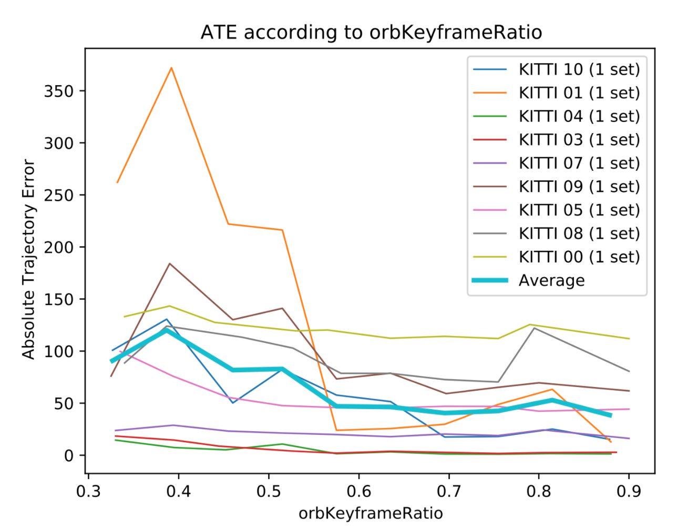

# libCML : SLAM library

# 1. About libCML

libCML is a SLAM library and scientific tool, which include a novel fast thread-safe graph map implementation. If you are using this work, please cite :
```bibtex
@misc{libcml,
  title={libCML : SLAM library},
  author={Thomas Belos, Pascal Monasse, Eva Dokladalova},
  url={https://github.com/belosthomas/libCML}
}
```

# 2. About MODSLAM

MODSLAM is a mixed ORB-SLAM2 and DSO SLAM system. If you are using this work, please cite : 
```bibtex
@inproceedings{modslam2021,
  title={MOD SLAM: Mixed Method for a More Robust SLAM without Loop Closing},
  author={Belos, T., Monasse, P. and Dokladalova, E.},
  booktitle={In Proceedings of the 17th International Joint Conference on Computer Vision, Imaging and Computer Graphics Theory and Applications (VISIGRAPP 2022)}
}
```

# 3. Compilation

**Minimum Ubuntu Version :** 20

**Minimum Fedora Version :** 34

## a. Windows, Linux and Mac

Required packages : 
```bash
apt install libsuitesparse-dev
```

Optional packages :
```bash
apt install libavcodec-dev libavformat-dev libavutil-dev libswscale-dev
```

We recommend you to use CLion from Jetbrains to build and test.
Otherwise, you can :

```bash
mkdir build
cd build
cmake -DCMAKE_BUILD_TYPE=Release ..
make -j 4
```

☕ Then, take a break, drink a cup of coffee. It can take hours time to build.

This is a list of different option you can pass to cmake : 
```bash
-DENABLE_GUI=OFF # Disable/Enable the gui
-DUSE_GOOGLE_HASH=ON # Disable/Enable Google Hash Map. Enabling this option cause the map to take more memory, but to be faster.
-DENABLE_OPENMP=OFF # Disable/Enable OpenMP
```

## b. Android and iPhone

We recommend you to use Qt Creator, as it is the most simple way to build ModSLAM on Android and iPhone.
Note that the code for Android is not maintained for the moment.

# 4. Execution

```bash
cd build
./modslam -d PATH_TO_THE_DATASET
```
where `PATH_TO_THE_DATASET` can be any dataset (TUM, KITTI, RobotCar, a mkv/mp4/avi/other video file...).
MODSLAM will automatically detect the right dataset format.

Here is a list of arguments you can pass to the executable : 
```bash
-c configfile.yaml # Load a specific config file
-g # Use Gui Mode
-t # Use Terminal Mode
-r path_to_result -f [tum|kitti|all] # Save the results with the specified format
-l log.txt # Write the log to a file
-s path_to_images # Export the 3D rendering to a ton of .jpeg files at specified folder
-z # Print the statistics at each iteration. Used for python script and result analasys.
```

# 5. Datasets

## KITTI Odometry

Download here : https://www.cvlibs.net/datasets/kitti/eval_odometry.php
 - Gray Scale Required
 - Color Optional
 - Groundtruth Optional

```
/KITTI
├── dataset
│   ├── poses
│   │   ├── 00.txt
│   │   ├── 01.txt
│   │   ├── 02.txt
│   │   ├── 03.txt
│   │   ├── 04.txt
│   │   ├── 05.txt
│   │   ├── 06.txt
│   │   ├── 07.txt
│   │   ├── 08.txt
│   │   ├── 09.txt
│   │   └── 10.txt
│   └── sequences
│       ├── 00
│       ├── 01
│       ├── 02
│       ├── 03
│       ├── 04
│       ├── 05
│       ├── 06
│       ├── 07
│       ├── 08
│       ├── 09
│       ├── 10
```

```bash
cd build
./modslam -d /KITTI/dataset/sequences/02
```


## Stereopolis

```
/Stereopolis
├── Camera_0.zip
├── Camera_0.gt.txt
├── Camera_0.mask.png
├── Camera_0.times.txt
├── Camera_0.xml
```

```bash
cd build
./modslam -d /Stereopolis/Camera_0.zip
```

# 5. Evaluation

```bash
cd result
python3 statson.py # Compute the absolute trajectory error of each videos
python3 bruteforce.py # Make statistics for the parameters / Search for a better parameters set
python3 make2dtable.py # Make a 2D table of the variation of ATE between by varying two parameters
```

The configuration file `evaluation/config.txt` contains the SLAMs and the datasets to evaluate on : 
```bash
ModSLAM "../cmake-build-release/modslam"
TUM "/home/thomas/Datasets/TUM"
KITTI "/home/thomas/Datasets/KITTI"
```

The configuration file `evaluation/modslam.yaml` is the SLAM configuration you want to initialize the python script with.

Each result is stored in a `.json` file. Experience are never run twice. If a the result of an experience is already present in the `.json` file, the experience will not run a second time.
You can plot all the result stored in the json database : 
```bash
python3 plotall.py
```

All the result are stored in a `result` folder. This is the kind of result you can except with a few experiences :


